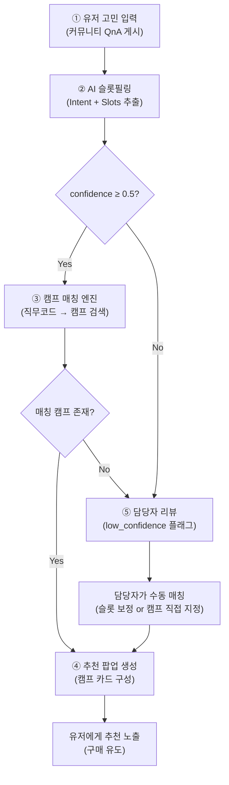

# TO-BE 자동화 프로세스: 유저 고민 → 캠프 추천

> **문서 성격**: Implementation Plan(스키마 설계)과 별도로, **유저 고민 입력부터 추천 결과 생성까지의 전체 흐름**과 **각 단계별 AI·데이터·담당자 역할**을 정의합니다.

> [!IMPORTANT]
> **v2 업데이트 (2026-09-21)**: 파일럿 구현(50건) 결과를 바탕으로 ②·③·⑤ 단계가 보완되었습니다. 원본 설계(v1)는 아래 내용대로 유지하되, **9번 섹션의 v2 보완 사항이 5번·7번·8번 섹션의 기준을 대체**합니다. 자세한 배경은 9번 섹션 참고.

---

## 1. AS-IS vs TO-BE 비교

| 구분 | AS-IS (현재) | TO-BE (목표) |
|:---|:---|:---|
| **고민 입력** | 커뮤니티 QnA 게시글 (자유 텍스트) | 동일 (변경 없음) |
| **분류** | 사람이 `스펙`, `직무`, `진로` 등 카테고리 수동 태깅 | **AI가 자동으로** Intent + Slots 추출 |
| **캠프 연결** | 없음 (1주차에서 유형화까지만 수행) | 슬롯 → 직무코드 → **캠프 후보 자동 매칭** |
| **추천 표시** | 없음 | 유저 고민 하단에 **팝업형 캠프 추천** 노출 |
| **담당자 역할** | 카테고리 태깅 + 답변 | low_confidence 건 **수동 리뷰** + 매칭 보정 |

---

## 2. 전체 파이프라인 흐름



---

## 3. 단계별 상세 설계

### ① 유저 고민 입력 (트리거)

| 항목 | 설명 |
|:---|:---|
| **주체** | 유저 |
| **입력** | QnA 게시글 (`question_title` + `question_content`) |
| **함께 수집되는 메타데이터** | `question_category`, `question_target_job`, `question_target_company` |
| **트리거 시점** | 유저가 QnA 게시글을 **작성 완료**한 시점 |
| **출력** | 원문 텍스트 + 메타데이터 → ② 단계로 전달 |

> [!NOTE]
> 현재 `community_qna_samples_20260910.xlsx`의 499건 데이터를 보면, 유저가 직접 입력하는 정보는 `title`, `content`, `target_job`, `target_company`, `category` 5개입니다. 이 중 `target_job`의 64%가 "모든 직무"이므로 AI 추출이 필수적입니다.

---

### ② AI 슬롯필링 (핵심 자동화)

| 항목 | 설명 |
|:---|:---|
| **주체** | **AI** (LLM) |
| **입력** | 원문 텍스트 + 유저 메타데이터 |
| **처리** | System Prompt에 Enum 목록 + 슬롯 스키마를 주입한 뒤, 고민 텍스트에서 JSON 슬롯필링 |
| **출력** | 슬롯필링 JSON (아래 예시 참조) |

**AI가 수행하는 구체적 작업**:

```
[INPUT]  유저 고민 원문 + 메타데이터(target_job, target_company, category)

[STEP 1] Intent 판정
         → primary_intent: 6개 코드 중 1개 선택
         → secondary_intent: 있으면 추가 (복합 고민)
         → confidence: 0.0 ~ 1.0

[STEP 2] Slot 추출 (5개 그룹)
         → interest_job: CSV의 직무대분류/중분류/소분류/상세에서 선택
         → interest_industry: CSV의 산업에서 선택
         → current_status: stage, major_group, experience_level
         → pain_points: detail_code 배열 (복수 가능)
         → desired_outcome: type 코드

[STEP 3] raw_mention 발췌
         → 각 슬롯에 대해 원문에서 근거 문장 발췌

[STEP 4] camp_matching_keys 생성
         → 직무코드 패턴 조합: {job_mid}-{job_detail}-{industry}

[OUTPUT] 슬롯필링 JSON
```

**활용하는 데이터**:
- `직무코드_캠프명_매핑.csv`에서 추출한 Enum 목록 (직무대분류 25개, 직무중분류 ~140개, 산업 ~50개)
- `pain_points` detail_code 18개 (사전 정의)
- `desired_outcome` type 7개 (사전 정의)

---

### ③ 캠프 매칭 엔진 (데이터 처리)

| 항목 | 설명 |
|:---|:---|
| **주체** | **데이터** (룰 기반 로직) |
| **입력** | 슬롯필링 JSON의 `camp_matching_keys` |
| **처리** | 4단계 폴백으로 캠프 후보 검색 |
| **출력** | 매칭된 캠프 목록 (0~N개) |

**매칭 로직 (3단계 폴백)**:

```
1순위: 정확매칭 — {job_category}-{job_detail}-{industry}
       예: "SW개발-백엔드-IT" → CSV에서 정확히 일치하는 캠프 검색
       
2순위: 상세생략 — {job_category}-N/A-{industry}
       예: "SW개발-N/A-IT" → 상세분류 없이 중분류+산업으로 검색

3순위: 산업확장 — {job_category}-{job_detail}-산업무관
       예: "SW개발-백엔드-산업무관" → 산업 무관한 캠프까지 확장
```

| 매칭 결과 | 후속 처리 |
|:---|:---|
| **1개 이상 매칭** | → ④ 추천 팝업 생성으로 진행 |
| **0개 매칭** (3단계 모두 실패) | → ⑤ 담당자 리뷰로 전환 |

---

### ④ 추천 팝업 생성 (결과 조합)

| 항목 | 설명 |
|:---|:---|
| **주체** | **데이터** (템플릿 기반) |
| **입력** | 매칭된 캠프 목록 + 슬롯필링 결과 |
| **처리** | 추천 사유 + 캠프 카드 조합 |
| **출력** | 유저에게 노출할 추천 팝업 데이터 |

**추천 팝업 구성 요소**:

```
┌─────────────────────────────────────────────┐
│  💡 이런 캠프는 어떠세요?                        │
│                                             │
│  고민 요약: "백엔드 개발 포트폴리오가 없어서 불안..."  │
│                                             │
│  📦 추천 캠프 1                               │
│  ┌─────────────────────────────────────┐     │
│  │ 백엔드 개발 프로젝트를 수행하며 실무 경험 쌓기 │     │
│  │ IT/SW > SW개발 > 백엔드              │     │
│  │ [캠프 상세보기] [신청하기]              │     │
│  └─────────────────────────────────────┘     │
│                                             │
│  📦 추천 캠프 2                               │
│  ┌─────────────────────────────────────┐     │
│  │ 기획부터 개발까지 파이썬 백엔드 개발 실무 체험 │     │
│  │ IT/SW > SW개발 > 백엔드              │     │
│  │ [캠프 상세보기] [신청하기]              │     │
│  └─────────────────────────────────────┘     │
│                                             │
│  추천 사유: 실무 경험 부족 → 직무 체험 캠프 추천    │
└─────────────────────────────────────────────┘
```

**추천 사유 생성 규칙** (Intent 기반):

| Intent | 추천 사유 템플릿 |
|:---|:---|
| `CAREER_DIRECTION` | "직무 방향을 탐색할 수 있는 체험 캠프를 추천드려요" |
| `SKILL_GAP` | "부족한 역량을 실무로 키울 수 있는 부트캠프를 추천드려요" |
| `EXPERIENCE_GAP` | "실무 경험을 쌓을 수 있는 직무 체험 캠프를 추천드려요" |
| `APPLICATION_PREP` | "이 캠프 수료 경험은 자소서·면접에서 강력한 소재가 돼요" |
| `CAREER_TRANSITION` | "새로운 직무를 직접 경험해볼 수 있는 전환 캠프를 추천드려요" |

---

### ⑤ 담당자 리뷰 (수동 개입 분기)

| 항목 | 설명 |
|:---|:---|
| **주체** | **담당자** (사람) |
| **개입 조건** | v1: ❶ confidence < 0.5 **또는** ❷ 캠프 매칭 0건 → **v2: 적합도 점수 기반으로 대체 (9번 섹션 참고)** |
| **작업** | 슬롯 보정, 캠프 직접 지정, 또는 추천 제외 판단 |
| **출력** | 보정된 슬롯 → ④로 재진입 **또는** 추천 제외 |

**담당자 리뷰 대시보드에 표시할 정보**:

| 표시 항목 | 내용 |
|:---|:---|
| 원문 | 유저 고민 전문 |
| AI 판정 결과 | Intent, 주요 슬롯값, confidence |
| `low_confidence` 사유 | "복합 고민으로 Intent 판정 불확실" 등 |
| 후보 캠프 | 매칭 엔진이 찾은 캠프 목록 (0건이면 비어있음) |
| **담당자 액션** | [슬롯 수정] [캠프 직접 지정] [추천 제외] |

---

## 4. 역할 구분 총정리

> [!NOTE]
> ⑤ 리뷰 단계의 개입 조건 및 표시 항목은 v2(9번 섹션)에서 적합도 점수·추출근거 기준으로 보완되었습니다.

| 단계 | AI (LLM) | 데이터 (룰/로직) | 담당자 (사람) |
|:---:|:---|:---|:---|
| ① 입력 | - | 원문 수신 & 전처리 | - |
| ② 슬롯필링 | ✅ **Intent + Slots 추출** | Enum 목록 제공 | - |
| ③ 캠프 매칭 | - | ✅ **직무코드 매칭 (4단계 폴백)** | - |
| ④ 추천 생성 | - | ✅ **추천사유 템플릿 조합** | - |
| ⑤ 리뷰 | - | low_confidence 플래그 제공 | ✅ **슬롯 보정 / 캠프 직접 지정** |

> [!IMPORTANT]
> **AI가 하는 일은 ② 한 단계뿐**입니다. 나머지는 룰 기반 로직과 담당자가 처리합니다. 이렇게 하면 AI의 비일관성 리스크를 최소화하면서도 자동화 효과를 극대화할 수 있습니다.

---

## 5. 실제 데이터로 시뮬레이션

### 시뮬레이션 A: `Q0454` — 스펙 부족 + 직무 미결정 복합

**① 입력**

| 필드 | 값 |
|:---|:---|
| title | "화공 4학년인데 지금 스펙으로 중견 취업이 가능할까요" |
| content | "직무는 아직 정하지 못했는데 일단 품질관리 또는 공정 엔지니어 쪽으로 생각중입니다. 만약 품질관리를 하게 된다면 화공기사 보다는 6시그마와 화분기를 따는 게 나을 지…" |
| target_job | 공정설계 |
| target_company | SK케미칼 |
| category | 스펙 |

**② AI 슬롯필링 결과**

```json
{
  "intent": {
    "primary": "SKILL_GAP",
    "secondary": "CAREER_DIRECTION",
    "confidence": 0.82
  },
  "slots": {
    "interest_job": {
      "job_category": "품질관리",
      "job_detail": null,
      "industry": "에너지/화학",
      "raw_mention": "품질관리 또는 공정 엔지니어 쪽으로 생각중, SK케미칼"
    },
    "current_status": {
      "stage": "SENIOR",
      "major_group": "이공계",
      "major_relevance": "RELATED",
      "year": 4,
      "experience_level": "NONE"
    },
    "pain_points": [
      {
        "type": "SKILL_GAP",
        "detail_code": "NO_CERTIFICATION",
        "raw_mention": "화공기사 보다는 6시그마와 화분기를 따는 게 나을 지"
      },
      {
        "type": "CAREER_DIRECTION",
        "detail_code": "MULTIPLE_OPTIONS",
        "raw_mention": "품질관리 또는 공정 엔지니어 쪽으로… 마음을 못 정했는데"
      }
    ],
    "desired_outcome": {
      "type": "IMPROVE_SKILL",
      "raw_mention": "어떤 준비를 해야하는지"
    }
  },
  "camp_matching_keys": {
    "job_code_prefix": "품질관리-N/A-에너지/화학",
    "fallback_codes": ["품질-N/A-에너지/화학", "공정기술-N/A-에너지/화학", "품질관리-N/A-산업무관"]
  }
}
```

**③ 캠프 매칭**

| 폴백 단계 | 검색 키 | 결과 |
|:---:|:---|:---|
| 1순위 | `품질관리-N/A-에너지/화학` | 0건 |
| 2순위 | `품질-N/A-에너지/화학` | ✅ **"대기업 현직자에게 배우는 품질관리 실무"** 등 |
| 3순위 | `품질관리-N/A-산업무관` | ✅ 추가 후보 |

**④ 추천 팝업**

> 💡 **부족한 역량을 실무로 키울 수 있는 부트캠프를 추천드려요**
> - 📦 "대기업 현직자에게 배우는 품질관리 실무" (에너지/화학)
> - 📦 "반도체 품질관리 현직자의 품질관리 실무" (산업무관)

**⑤ 담당자 리뷰**: confidence 0.82 → 리뷰 불요 ✅

---

### 시뮬레이션 B: `Q0657` — 이직 고민

**① 입력**

| 필드 | 값 |
|:---|:---|
| title | "건설사 토목엔지니어인데 제조업으로 옮기고 싶습니다" |
| content | "같은 건설업 안에서 회사를 바꾸는 것보다 제조업으로 넘어가는 쪽을 계속 마음에 두고 있습니다…" |
| target_job | 경영지원 |
| target_company | 현대자동차 |

**② AI 슬롯필링 결과**

```json
{
  "intent": {
    "primary": "CAREER_TRANSITION",
    "secondary": null,
    "confidence": 0.91
  },
  "slots": {
    "interest_job": {
      "job_category": "토목",
      "job_detail": null,
      "industry": "자동차",
      "raw_mention": "토목엔지니어, 현대자동차, 제조업으로 넘어가는 쪽"
    },
    "current_status": {
      "stage": "EMPLOYED",
      "major_group": "이공계",
      "major_relevance": "RELATED",
      "year": 3,
      "experience_level": "WORK"
    },
    "pain_points": [
      {
        "type": "CAREER_TRANSITION",
        "detail_code": "INDUSTRY_CHANGE",
        "raw_mention": "건설업에서 제조업으로 넘어가는 쪽을 계속 마음에"
      }
    ],
    "desired_outcome": {
      "type": "CAREER_SWITCH",
      "raw_mention": "무엇부터 어떻게 준비해야 하는지"
    }
  },
  "camp_matching_keys": {
    "job_code_prefix": "토목-N/A-자동차",
    "fallback_codes": ["토목-N/A-건설/중공업", "토목-N/A-산업무관"]
  }
}
```

**③ 캠프 매칭**

| 폴백 단계 | 검색 키 | 결과 |
|:---:|:---|:---|
| 1순위 | `토목-N/A-자동차` | 0건 |
| 2순위 | `토목-N/A-건설/중공업` | ✅ **"건설사 토목직 현직자의 업무 체험하기"** |
| 3순위 | `토목-N/A-산업무관` | 0건 |

> [!NOTE]
> 이 케이스에서 유저는 **토목에서 제조업으로 전환**하고 싶어하지만, CSV에 "제조업 + 토목" 캠프가 없습니다. 2순위로 건설/중공업 토목 캠프가 매칭되나, 유저 의도와 완전히 맞지 않을 수 있습니다. → **담당자가 "제조업 쪽 유사 캠프"를 수동 추가** 판단 가능

---

## 6. 데이터 흐름 요약

```mermaid
flowchart LR
    subgraph INPUT["입력 데이터"]
        A1["question_title"]
        A2["question_content"]
        A3["target_job"]
        A4["target_company"]
        A5["category"]
    end

    subgraph AI["AI 슬롯필링"]
        B1["Intent (6개 코드)"]
        B2["interest_job (CSV Enum)"]
        B3["interest_industry (CSV Enum)"]
        B4["current_status"]
        B5["pain_points (18개 코드)"]
        B6["desired_outcome (7개 코드)"]
    end

    subgraph MATCHING["캠프 매칭"]
        C1["camp_matching_keys 생성"]
        C2["CSV 788개 캠프 검색"]
        C3["4단계 폴백"]
    end

    subgraph OUTPUT["결과"]
        D1["추천 캠프 목록"]
        D2["추천 사유"]
        D3["추천 팝업"]
    end

    INPUT --> AI --> MATCHING --> OUTPUT
```



---

## 7. 예외 처리 정책

| 예외 상황 | 처리 방법 | 담당 |
|:---|:---|:---:|
| **confidence ≤ 0.5** | `low_confidence` 플래그 → 담당자 리뷰 큐에 추가 (v2에서도 독립 조건으로 유지 — 9번 섹션 참고) | 담당자 |
| **캠프 매칭 0건** (4단계 폴백 모두 실패) | 담당자에게 알림 → 캠프 직접 지정 또는 추천 제외 | 담당자 |
| **적합도 점수 ≤ 50점** (v2 신규) | 매칭레벨+confidence+추출근거 종합 점수가 낮으면 담당자 리뷰 (카테고리 폴백 매칭이 자동으로 이 조건에 포함됨) | 담당자 |
| **취업 고민이 아닌 카테고리 그룹** (v2 신규, `question_category_group ≠ '취업 고민'`) | 슬롯필링 대상에서 제외 (이직 고민/대학생 고민/랜선 사수 등은 별도 트랙) | 데이터 |
| **고민 내용 너무 짧음** (10자 미만) | 슬롯필링 스킵 → 추천 미생성 | 데이터 |
| **CSV에 없는 직무 언급** | 가장 가까운 기존 Enum에 매핑 (Phase 1) — **파일럿에서 AI가 다른 필드(enum list)의 값을 잘못 매핑하는 사례 확인, 9번 섹션에 원인·보완안 정리** | AI |
| **복합 고민** (Intent 2개 이상) | 각 Intent별로 캠프 매칭 수행 → 합산하여 추천 | 데이터 |
| **동일 유저 반복 질문** | 이전 추천과 중복 제거 | 데이터 |

---

## 8. 성과 측정 지표 (KPI)

| 지표 | 측정 방법 | 목표 |
|:---|:---|:---|
| **자동 처리율** | v2: (confidence > 0.5 & 적합도 점수 > 50) / 전체 (매칭 0건·카테고리 폴백은 점수 조건에 이미 포함됨) | ≥ 70% |
| **슬롯 일관성** | 동일 고민 3회 추출 시 코드 일치율 | ≥ 90% |
| **캠프 매칭 적중률** | 담당자가 "적절하다" 판정한 비율 | ≥ 80% |
| **추천 클릭률** | 팝업 내 "캠프 상세보기" 클릭 / 노출 | TBD |
| **구매 전환율** | 추천 경유 캠프 구매 / 추천 클릭 | TBD |

---

## 9. v2 보완: 파일럿(50건) 검증 결과 반영

> 1·2주차 설계(v1)를 실제 50건 파일럿으로 구현·실행하면서 드러난 문제와 그 보완 내용입니다. v1의 큰 구조(AI/데이터/담당자 역할 분리, 3+1단계 폴백)는 그대로 두고, ⑤ 담당자 리뷰 조건만 정교화했습니다.

### 9-1. 카테고리 그룹 필터링 추가

v1은 `question_category` 기준으로만 슬롯을 설계했고 `question_category_group` 필터가 없었습니다. 파일럿 표본에 "이직 고민", "대학생 고민", "랜선 사수" 그룹이 섞여 들어오면서, 애초에 캠프 매칭 대상이 아닌 글(예: NCS 시험 팁 질문)까지 슬롯필링을 시도해 저품질 추출 사례가 발생했습니다.

→ `run_slot_filling.py`에서 `question_category_group == '취업 고민'`인 데이터만 필터링 후 진행 (전체 499건 중 474건, 95%가 해당).

### 9-2. `matched_level` 산출 방식 수정

v1 문서(③ 캠프 매칭)는 폴백을 3+1단계로 설명했지만, 실제 구현 초안에서는 AI가 생성한 `camp_matching_keys`를 검색 키 목록에 섞어 넣는 과정에서 **동일한 "카테고리 폴백" 매칭이 케이스마다 3순위 또는 4순위로 다르게 기록**되는 버그가 있었습니다. 레벨 번호를 아래처럼 고정으로 재정의했습니다.

| 레벨 | 의미 | 검색 키 |
|:---:|:---|:---|
| 1 | 정확매칭 | `{job_category}-{job_detail}-{industry}` |
| 2 | 상세생략 | `{job_category}-N/A-{industry}` |
| 3 | 산업확장 | `{job_category}-{job_detail}-산업무관` |
| 4 | 카테고리 폴백 | `{job_category}` 전체 |
| 0 | 매칭 실패 | - |

AI가 생성하는 `camp_matching_keys`는 감사/참고용으로만 결과에 남기고, 실제 매칭 검색에는 사용하지 않도록 변경했습니다 (AI 산출값과 알고리즘 산출값이 다를 경우 레벨 정의가 흔들리는 것을 방지).

### 9-3. 슬롯별 추출근거(basis) 도입

`interest_job`의 `job_category`, `industry`에 대해 AI가 어떤 근거로 판단했는지 3단계로 분류하도록 시스템 프롬프트를 확장했습니다.

- `명시`: 유저가 직무/산업명을 문장에 직접 언급
- `추론`: 직접 언급은 없으나 회사명·업무 설명 등 문맥으로 판단
- `없음`: 근거 부족, 추측에 가까움 (값이 `null`이면 basis도 `없음`)

### 9-4. 적합도 점수 시스템 (v1의 담당자 리뷰 조건 대체)

v1은 "confidence < 0.5 또는 매칭 0건"만 리뷰 조건으로 정의했는데, 파일럿에서 **카테고리 폴백(레벨 4) 매칭 30%가 이 조건을 통과해 리뷰 없이 "정상 매칭"과 동일하게 노출되는 사각지대**가 발견됐습니다. 이를 보완하기 위해 `matched_level` + `confidence` + `추출근거`를 합산한 0~100점 적합도 점수를 도입했습니다.

| 항목 | 배점 | 세부 기준 |
|:---|:---:|:---|
| 매칭레벨 | 최대 50 | 1=50, 2=30, 3=15, 4=0, 0=0 |
| confidence | 최대 30 | `confidence × 30` |
| 추출근거 | 최대 20 | job_category 근거(명시12/추론6/없음0) + industry 근거(명시8/추론4/없음0) |

레벨 0·4는 0점 처리되어, confidence와 근거가 아무리 좋아도 최대 50점(=confidence 30 + 근거 20)을 넘지 못합니다. 즉 매칭 실패·카테고리 폴백은 **다른 지표와 무관하게 항상 담당자 리뷰 대상**이 되도록 설계했습니다.

**최종 담당자 리뷰 조건 (두 조건 OR, 독립적으로 적용)**:
1. `confidence ≤ 0.5` (v1 조건 유지 — 점수가 50점을 넘어도 confidence 자체가 낮으면 별도로 걸러냄)
2. `적합도 점수 ≤ 50`

파일럿 재실행(50건, 취업 고민 필터 적용 후) 결과: 리뷰 대상 26건 = 카테고리 폴백/매칭실패 25건(NO_CAMP_MATCH 6 + LOW_SUITABILITY_SCORE 19) + confidence만 낮은 사례 1건(레벨 2로 정상 매칭됐지만 confidence 0.35라 별도 조건으로 걸러진 케이스).

### 9-5. Enum 위반(교차 오염) 원인 분석 — 미해결 이슈

v1의 예외 처리 정책(7번)은 "CSV에 없는 직무 언급 → 가장 가까운 Enum에 매핑"으로 정의했지만, 실제로는 **AI가 없는 값을 만드는 게 아니라 다른 필드(enum 리스트) 소속의 값을 잘못된 필드에 넣는 교차 오염**이 반복 발생했습니다 (파일럿 100건 중 4건, ~4%).

| 사례 | 원문 근거 | 잘못 채워진 필드 | 실제 소속 리스트 |
|:---|:---|:---|:---|
| "지역 국립대 공기업 지역인재" | "공기업" 명시 | `job_category = "공기업"` | industry 전용 값 |
| "ncs에서 가장 성적올리기 쉬운 파트" | 직무 언급 전혀 없음 (NCS 시험 팁 질문) | `job_category = "공기업"` | industry 전용 값 (그마저도 원문에 없는 추측) |
| "회로 설계 직무를 보고 있는데" | "회로 설계" 명시 | `job_category = "회로설계"` | job_detail 전용 값 |
| BGF 물류센터 명칭 질문 | 물류 관련 문맥 | `job_detail = "물류유통"` | job_category 전용 값 |

**원인 2가지**:
1. job_category/job_detail/industry 세 Enum 리스트에 개념적으로 겹치는 단어가 서로 다른 리스트에만 존재하는데, 프롬프트가 "이 값은 반드시 해당 필드 리스트에서만 골라야 한다"는 교차 금지 지침 없이 세 리스트를 나열만 하고 있음
2. "매칭되는 값이 없거나 모호하면 가장 가까운 Enum을 선택하라"는 절대 규칙이, 원문에 직무 정보가 전혀 없는 경우(NCS 질문 사례)에도 `null` 대신 억지로 값을 채우도록 유도함

**보완 방향 (미적용, 논의 필요)**:
- (프롬프트) 각 필드 설명 앞에 "이 값은 반드시 아래 job_category 리스트 중 하나여야 하며, industry/job_detail 리스트의 단어를 여기 넣으면 안 됨" 교차 오염 금지 문구 추가, 절대 규칙 2를 "직무 관련 정보가 전무하면 null 유지, 있는데 애매할 때만 근접 Enum 선택"으로 정정
- (코드) 프롬프트만으로는 100% 방지 어려움 → 응답 후 `data/enums.json` 대조 검증을 추가해, 위반 시 재질의 또는 해당 필드만 `null` 처리하는 후처리 로직 병행 권장
